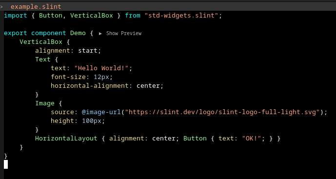

# `slint-mode`: An emacs major-mode for the Slint UI language

This package contains a very simple major mode for the Slint UI language.

To learn more about slint, visit https://slint.dev/.

## Features

This mode is very limited at this point. Supported so far is:
- Syntax highlighting (aka font-lock)
- Indentation (configurable via `slint-indent-level` custom variable)
- Comment / uncomment region
- LSP integration using [lsp-mode](https://emacs-lsp.github.io/lsp-mode/) together with [slint-lsp](https://github.com/slint-ui/slint/blob/master/tools/lsp/README.md).

## Screenshot

This is how the "Hello World" example from Slint looks like:

